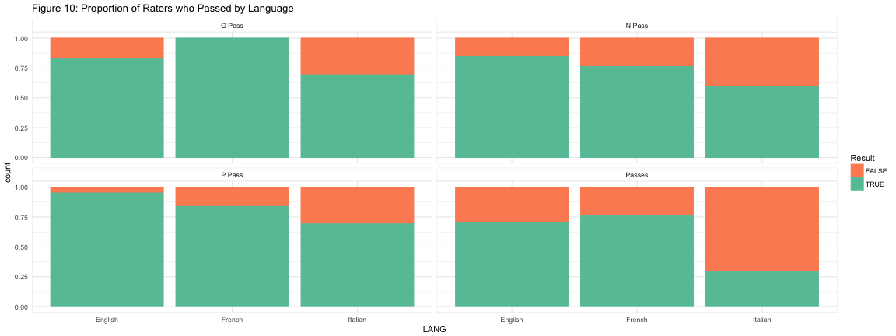

Data Analysis System and Results of PANSS Training
========================================================
author: Kaisa Roggeveen and Scott Graham
date: March 1 2018
autosize: true

Background Information
========================================================

Data Collection System
========================================================

 <http://grahamst.at/shiny-server/PANSS/Input_App/>.

Data Analysis System
========================================================

 <http://grahamst.at/shiny-server/PANSS/Results_App/>.

Results
========================================================

|Language | Passed P| Passed N| Passed G| Passed| Total Physicians|
|:--------|--------:|--------:|--------:|------:|----------------:|
|English  |       46|       41|       40|     34|               48|
|French   |       11|       10|       13|     10|               13|
|Italian  |        7|        6|        7|      3|               10|

========================================================

Logistic Regression
========================================================

Slide With Plot
========================================================

