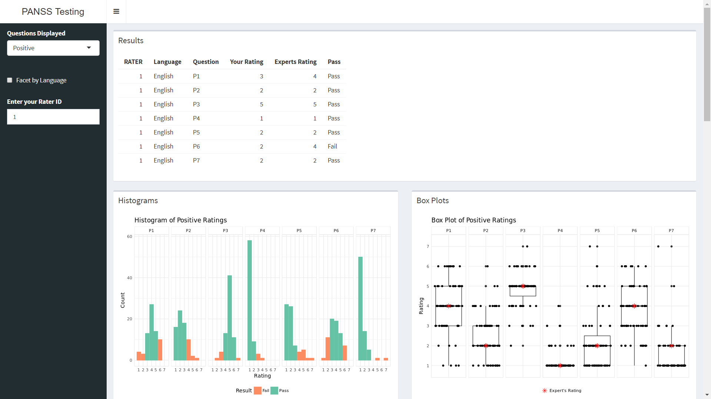
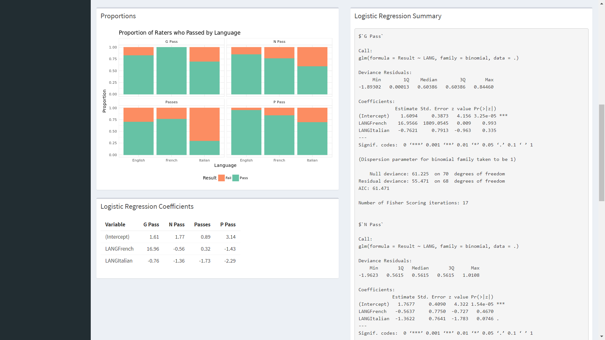
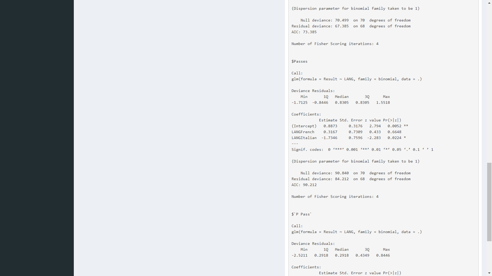

```{r setup, include=FALSE}
knitr::opts_chunk$set(echo = FALSE)
library(pander, warn.conflicts = FALSE, quietly = TRUE)
library(knitr, warn.conflicts = FALSE, quietly = TRUE)
library(tidyverse, warn.conflicts = FALSE, quietly = TRUE)
library(magrittr, warn.conflicts = FALSE, quietly = TRUE)
library(ggfortify, warn.conflicts = FALSE, quietly = TRUE)

theme_minimal2 <- theme_minimal() %>%  theme_set()
theme_minimal2 <-
  theme_update(
    panel.border = element_rect(
      linetype = "solid"
      ,colour = "grey92"
      ,fill = NA
    )
    ,strip.background = element_rect(
      linetype = "solid"
      ,colour = "grey92"
      ,fill = NA
    )
  )

# Data Import ----------
panss <-
  "../data/Panssdata_Modified.csv" %>% 
  read_csv() %>% 
  filter_all(all_vars(!is.na(.))) %>% 
  mutate(
    LANG = if_else(LANG == "E", "English", LANG)
    ,LANG = if_else(LANG == "F", "French", LANG)
    ,LANG = if_else(LANG == "I", "Italian", LANG)
  ) %>% 
  rename(
    G01 = G1
    ,G02 = G2
    ,G03 = G3
    ,G04 = G4
    ,G05 = G5
    ,G06 = G6
    ,G07 = G7
    ,G08 = G8
    ,G09 = G9
  ) 

# Data Cleaning ----------
panss_rater <- 
  panss %>% 
  filter(RATER == 0)

panss_tests <- 
  panss %>% 
  filter(RATER != 0)

panss_diff <-
  as.tibble(
    abs(panss_tests[, -2] - panss_rater[rep(x = 1, times = as.numeric(count(panss_tests))), -2])
  ) %>% 
  mutate_all(as.double) %>% 
  mutate_at(
    .vars = vars(-matches("RATER"))
    ,.funs = ~ ifelse(. == 1, . - 1, .)
  ) %>%
  mutate_at(
    .vars = vars(-matches("RATER"))
    ,.funs = ~ ifelse(. != 0, 0, 1)
  ) %>%
  left_join(
    panss_tests %>% 
      select(RATER, LANG)
    ,by = "RATER"
  )

panss_results <-
  panss_diff %>% 
  transmute(
    RATER = RATER
    ,LANG = LANG
    ,P = P1 + P2 + P3 + P4 + P5 + P6 + P7
    ,N = N1 + N2 + N3 + N4 + N5 + N6 + N7
    ,G = G01 + G02 + G03 + G04 + G05 + G06 + G07 + G08 + G09 + G10 + G11 + G12 + G13 + G14 + G15 + G16
  ) %>% 
  mutate(
    `P Pass` = if_else(P >= 5, TRUE, FALSE)
    ,`N Pass` = if_else(N >= 5, TRUE, FALSE)
    ,`G Pass` = if_else(G >= 10, TRUE, FALSE)
    ,Passes = if_else(`P Pass` & `N Pass` & `G Pass`, TRUE, FALSE)
  )

panss_rater_all_lang <- 
  panss_rater %>% 
  gather(
    key = "Question"
    ,value = "Rating"
    ,-RATER
    ,-LANG
  ) %>% 
  union(
    panss_rater %>% 
      gather(
        key = "Question"
        ,value = "Rating"
        ,-RATER
        ,-LANG
      ) %>% 
      mutate(LANG = "French")
  ) %>% 
  union(
    panss_rater %>% 
      gather(
        key = "Question"
        ,value = "Rating"
        ,-RATER
        ,-LANG
      ) %>% 
      mutate(LANG = "Italian")
  )
```
Dr. Ken Gardner

Assistant Registrar College of Physicians and Surgeons

Province of Alberta

February 28 2018


# Summary
The intent of this report was to develop a data entry and analysis system for the PANSS instrument where results could be calculated in less than a half hour. The data entry system was designed to give each physician a unique ID, a language selection, a scale to input the severity of each symptom and save all entries into a file. The data analysis system was designed to retrieve the saved file and allow physicians to enter their unique ID. The data analysis system determined whether the physician received a passing score for each PANSS system and displayed the overall results for physicians receiving passing scores based on their language. From this analysis it was determined that language does influence the passing score of the physician.


# Introduction
The Positive and Negative Syndrome Scale (PANSS) Instrument is a test used for accurately assessing the status of a patient's psychosis. The PANSS assessment involves physicians ranking a patient's psychological symptoms on a scale from 1 to 7, low to high respectively. 

There are thirty different psychological symptoms that the physicians will rank. The first seven scaled symptoms are the positive symptoms, delusions, conceptual disorganization, hallucinatory behavior, excitement, grandiosity and  auspiciousness/persecution and hostility. The next seven scaled symptoms are the negative symptoms, blunted affect, emotional withdrawal, poor rapport, passive/apathetic social withdrawal, difficulty in abstract thinking, lack of spontaneity and stereotyped thinking. The final symptoms scaled are the generic symptoms, somatic concern, anxiety, guilt feeling, tension, mannerisms and posturing, depression, motor retardation, cooperativeness, unusual thought content, disorientation, poor attention, lack of judgement and insight, disturbance of volition, poor impulse control, preoccupation and active social avoidance. 

This report is studying the affects of the PANSS instrument being used in different languages and the affects that language has on a physician reeving a passing score. This report explains the development of the Apps for a PANSS testing workshop for the data entry and the data analysis.

The data entry app was designed to be used during the PANSS testing and the data analysis app was designed to be used after all physicians in the workshop had entered their data. 


# Data Collection Protocol
In order to collect the data, an application was developed using the Shiny Package in R. To use this application each physician must have access to a computer and the internet during the assessment.

The app is accessible through a webpage that is published by the Statistical Consulting Services from the Department of Mathematical Statistics at the University of Calgary. An example of this can be found at http://grahamst.at/shiny-server/PANSS/Input_App/.

This application gives each physician a unique Rater ID, and each physician would be able to select their choice of language to complete the ratings of the patients symptoms. 

{height=25%}

The application displays the three symptom sections, positive, negative and generic, in individual columns. The first column displays the seven positive symptoms, the second column displays the seven negative symptoms and the last column displays the 16 generic symptoms. Each physician can rate the symptom on a slider-scale between 1 (low) and 7 (high). Once the physician is satisfied with all of their responses, they can submit their responses. All of the submitted responses are collected in a comma-departed values (CSV) document or uploaded into a database table. 

{height=30%}

This data entry system was designed to prevent common issues seen in data collection. The system takes the inputs directly from the physicians and saves their responses in a CSV file, which eliminates potential errors made my humans when imputing the data. This system only allows physicians to choose numbers between 1 and 7, and therefore no numbers outside of these values would be recorded. The system also displays all of the questions at once so the physician can easily review their imputed symptom ratings.


# Data Analysis
## Data Analysis System
To create a quick and effective data analysis system an application was developed using the Shiny package in R. To view the results from the data analysis an individual physician would need access to a computer and the internet or the overall results could be shown to all physicians on an overhead screen.

This application is also accessible through a webpage that is published by the Statistical Consulting Services from the Department of Mathematical Statistics at the University of Calgary. An example of this can be found at http://grahamst.at/shiny-server/PANSS/Results_App/. Or seen in figures 3-5.

The application has a drop down menu where the physician can choose to display the results to a given question set, a check box set the results by language and the ability for physicians to enter their unique ID, and display their results. 

The data analysis application gathers the data from the CSV file/database that was created in the input application. The data then runs through a data cleaner which checks that there are no responses outside of the scope of the questions. Next the physicians' ratings are compared to the experts ratings for each symptom. The results of this comparison are printed in a table where the physician can review their scores and determine where they made errors. 

The data analysis also displays overall results for all physicians. Histograms are used as a visual representation of the data. The histograms that are created for each section and each section can be stratified by language. In the histograms, the passing scores are colored in green and failing scores are colored in orange. 

The data was also visualized using Box Plots. The expert's rating was marked by a red star (*), and can be stratified by language.

To visualize overall passing scores bar plots of the proportion of raters who passed in each language are created for each section, Positive Symptoms, Negative Symptoms, Generic Symptoms and Overall Results. In the bar plots a passing score is colored as green and a failing score are colored in orange. These bar plots allow for a quick visualization of the data and the differences between the proportion of physicians passed based on language.   








## Data Cleaning
```{r Data Changes}
tibble(
  RATER = c(10, 32, 40, 62)
  ,LANG = 
    c(
      "English"
      ,"French"
      ,"Italian"
      ,"Italian"
    )
  ,P3 = c(8, 5, 2, 6)
  ,P7 = c(2, 2, 9, 1)
  ,N2 = c(5, 4, 5, 0)
  ,N7 = c(1, ".", 3, 2)
) %>% 
  kable(caption = "Data Entry Errors")
```

The initial step into analyzing the data was to remove variables that were outside of the allowed inputs. The first screening test was if there were any symbols in the ratings. Any symbols found were removed and the rating was marked as NA. The second screening test was to identify letters in the ratings. If the letter "l" was found it was replaced by the number 1, otherwise the rating was marked at NA. The final step taken to clean the ratings of errors was to make sure all of the numbers were in between 1 and 7. If a rating was scored as "0" it was changed to a "1" and if a rating was scored as an "8" or a "9", the rating was changed to a "7".

## Physician's Passing Score
To determine if a physician "passed" or "failed" the training they must meet certain criteria. The first criteria check was comparing each physician's symptom rating to an expert's symptom rating, if the physicians rating was within 1 of the expert's rating they received a "pass" on that symptom. 

The second criteria check was the total number of "pass" questions in the positive, negative and generic symptoms sections. To receive a "pass" in the positive and negative symptoms sections at least 5 out of the 7 symptoms must be a "pass". To receive a "pass" in the generic symptoms section at least 10 out of the 16 must be a "pass".

The third criteria checked was if the physician "passed" all three sections. If the physician "passed" all three sections, then they received a "pass" for the PANSS training.

The following table shows the summary results of the physicians. The full results can bee seen in Appendix B.
```{r Results Summary}
panss_results %>% 
  group_by(LANG) %>%
  summarize_if(.predicate = is.logical, .funs = c(sum, length)) %>% 
  select(
    Language = LANG
    ,`Passed P` = `P Pass_.Primitive("sum")`
    ,`Passed N` = `N Pass_.Primitive("sum")`
    ,`Passed G` = `G Pass_.Primitive("sum")`
    ,`Passed` = `Passes_.Primitive("sum")`
    ,`Total Physicians` = `Passes_.Primitive("length")`
  ) %>%
  kable(caption = "Number of Passes")
```

\newpage

```{r Results Mean}
panss_results %>% 
  group_by(LANG) %>%
  select(-RATER) %>% 
  summarize_if(.predicate = is.numeric, .funs = mean) %>% 
  rename(Language = LANG) %>%
  kable(caption = "Mean Number of Questions Passed", digits = 4)
```

```{r Results SD}
panss_results %>% 
  group_by(LANG) %>%
  select(-RATER) %>% 
  summarize_if(.predicate = is.numeric, .funs = sd) %>%  
  rename(Language = LANG) %>%
  kable(caption = "SD Number of Questions Passed", digits = 4)
```


## Effect of Language on Passing Score
To visualize the data, histograms the symptoms were stratified by language. The passing scores are colored in green and the failing scores are colored in orange. 

```{r P Hist, fig.height=3.5}
panss_hist <- 
  panss_tests %>% 
  gather(
    key = "Question"
    ,value = "Rating"
    ,-RATER
    ,-LANG
  ) %>% 
  left_join(
    panss_rater_all_lang %>% 
      select(-RATER)
    ,by = c("Question", "LANG")
    ,suffix = c("", " Expert")
  ) %>% 
  mutate_if(
    .predicate = is.character
    ,.funs = as.factor
  ) %>% 
  mutate(
    LB = `Rating Expert` - 1
    ,UB = `Rating Expert` + 1
    ,Pass = if_else(Rating >= LB & Rating <= UB, "Pass", "Fail") %>% as.factor()
  )

panss_hist %>% 
  filter(str_detect(Question, "P")) %>% 
  ggplot(
    aes(
      x = Rating
      ,fill = Pass
      ,colour = Pass
    )
  ) +
  geom_bar() +
  scale_fill_brewer(
    type = "qual"
    ,palette = "Set2"
    ,direction = -1
  ) +
  scale_colour_brewer(
    type = "qual"
    ,palette = "Set2"
    ,direction = -1
  ) +
  scale_x_discrete(limit = 1:7) +
  labs(
    title = "Figure 6: Histogram of Positive Ratings"
    ,x = "Rating"
    ,y = "Count"
    ,fill = "Result"
    ,colour = "Result"
  ) +
  theme(legend.position = "bottom") +
  facet_grid(
    LANG ~ Question
    ,scales = "free_y"
  )
```

The P set was performed fairly well among all 3 languages, with English respondents performing slightly better in terms of number of questions answered correctly. P7 for the French, and P4 for the Italians were both answered perfectly.

```{r N Hist, fig.height=3.5}
panss_hist %>% 
  filter(str_detect(Question, "N")) %>% 
  ggplot(
    aes(
      x = Rating
      ,fill = Pass
      ,colour = Pass
    )
  ) +
  geom_bar() +
  scale_fill_brewer(
    type = "qual"
    ,palette = "Set2"
    ,direction = -1
  ) +
  scale_colour_brewer(
    type = "qual"
    ,palette = "Set2"
    ,direction = -1
  ) +
  scale_x_discrete(limit = 1:7) +
  labs(
    title = "Figure 7: Histogram of Negative Ratings"
    ,x = "Rating"
    ,y = "Count"
    ,fill = "Result"
    ,colour = "Result"
  ) +
  theme(legend.position = "bottom") +
  facet_grid(
    LANG ~ Question
    ,scales = "free_y"
  )
```

The English again on average did the best among the 3 languages, with N6 being the only question with no failures for the French.

```{r G 0108 Hist, fig.height=3.5}
panss_hist %>% 
  filter(
    str_detect(Question, "G0")
    ,Question != "G09"
  ) %>% 
  ggplot(
    aes(
      x = Rating
      ,fill = Pass
      ,colour = Pass
    )
  ) +
  geom_bar() +
  scale_fill_brewer(
    type = "qual"
    ,palette = "Set2"
    ,direction = -1
  ) +
  scale_colour_brewer(
    type = "qual"
    ,palette = "Set2"
    ,direction = -1
  ) +
  scale_x_discrete(limit = 1:7) +
  labs(
    title = "Figure 8: Histogram of General Ratings (G01-G08)"
    ,x = "Rating"
    ,y = "Count"
    ,fill = "Result"
    ,colour = "Result"
  ) +
  theme(legend.position = "bottom") +
  facet_grid(
    LANG ~ Question
    ,scales = "free_y"
  )
```


```{r G 0916 Hist, fig.height=3.5}
panss_hist %>% 
  filter(
    str_detect(Question, "G1") | Question == "G09"
  ) %>% 
  ggplot(
    aes(
      x = Rating
      ,fill = Pass
      ,colour = Pass
    )
  ) +
  geom_bar() +
  scale_fill_brewer(
    type = "qual"
    ,palette = "Set2"
    ,direction = -1
  ) +
  scale_colour_brewer(
    type = "qual"
    ,palette = "Set2"
    ,direction = -1
  ) +
  scale_x_discrete(limit = 1:7) +
  labs(
    title = "Figure 9: Histogram of General Ratings (G09-G16)"
    ,x = "Rating"
    ,y = "Count"
    ,fill = "Result"
    ,colour = "Result"
  ) +
  theme(legend.position = "bottom") +
  facet_grid(
    LANG ~ Question
    ,scales = "free_y"
  )
```

G10 and G14 were both answered perfectly by the French and Italians, as well as G10 for the Italians. G16 was troublesome for all 3 languages. The Italians do perform noticeably worse compared to the French and English here.


## Proportions of Raters who Passed by Language
```{r Prop of R, fig.height= 3.5}
panss_results %>% 
  select(
    -c(
      P
      ,N
      ,G
    )
  ) %>% 
  gather(
    key = "Test"
    ,value = "Result"
    ,-RATER
    ,-LANG
  ) %>% 
  ggplot(
    aes(
      x = LANG
      ,colour = Result
      ,fill = Result
    )
  ) +
  geom_bar(position = "fill") +
  facet_wrap(
    ~ Test
    ,scales = "fixed"
  ) +
  scale_fill_brewer(
    type = "qual"
    ,palette = "Set2"
    ,direction = -1
  ) +
  scale_colour_brewer(
    type = "qual"
    ,palette = "Set2"
    ,direction = -1
  ) +
  labs(title = "Figure 10: Proportion of Raters who Passed by Language")
```

In the bar plots above there are some noticeable differences between the language and the number of physicians who passed and their language. 

It appears that the proportions of Italian speaking physicians who passed the PANSS training is the lowest for all sections and overall received the lowest proportion of physicians who passed. 

The french speaking physicians had a lower proportion than the English speakers in the negative and positive symptoms sections. However all of the french speakers passed the generic symptom section and therefore more passed than the English speakers. 

The English had the highest proportion of physicians who passed for the the positive and negative symptoms sections. The English speaking physicians had second highest proportions of physicians who passed the generic symptoms section, they were behind the french speaking physicians.

From these plots it can be speculated that language does affect the passing score of a physician in the PANSS training. To address this issue logistic regression models are used. 


## Regression Analysis
A logistic regression was preformed on the results from the 3 question sets, as well as the end result, using language as the predictor. For all 4 regressions, the English respondents are used as the base case for comparing against the French respondents and the Italian respondents. This allowed us to make see the effect language played on the respondents odds of passing the tests. Specifically by taking $e^{\hat{\beta}_{i}}$, we can find the average multiplicative increase of the log odds in favor of passing of a given language $i$ vs. English.

```{r P Pass Regression}
panss_logit <- 
  panss_results %>% 
  select(
    LANG
    ,contains("Pass")
  ) %>% 
  gather(
    key = Set
    ,value = Result
    ,-LANG
  ) %>% 
  mutate_all(as.factor) %>% 
  split(.$Set) %>% 
  map(
    ~ glm(
      Result ~ LANG
      ,data = .
      ,family = binomial
    )
  )

panss_logit$`P Pass` %>% 
  pander(caption = "Passes Question Set P by Language")
```

For the P questions, the odds in favor of passing of a French respondent compared to an English respondent increased on average by a multiplicative factor of `r round(exp(coef(panss_logit$"P Pass"))[["LANGFrench"]], 4)`. For an Italian respondent compared to an English respondent, the odds in favor of passing increased on average by a multiplicative factor of `r round(exp(coef(panss_logit$"P Pass"))[["LANGItalian"]], 4)`

```{r N Pass}
panss_logit$`N Pass` %>% 
  pander(caption = "Passes Question Set N by Language")
```

For the N questions, the odds in favor of passing of a French respondent compared to an English respondent increased on average by a multiplicative factor of `r round(exp(coef(panss_logit$"N Pass"))[["LANGFrench"]], 4)`. For an Italian respondent compared to an English respondent, the odds in favor of passing increased on average by a multiplicative factor of `r round(exp(coef(panss_logit$"N Pass"))[["LANGItalian"]], 4)`

```{r G Pass}
panss_logit$`G Pass` %>% 
  pander(caption = "Passes Question Set G by Language")
```

For the G questions, the odds in favor of passing of a French respondent compared to an English respondent can't be calculated as all of the French respondents passed the G questions, hence the nonsensical output in the regression. For an Italian respondent compared to an English respondent, the odds in favor of passing increased on average by a multiplicative factor of `r round(exp(coef(panss_logit$"G Pass"))[["LANGItalian"]], 4)`

```{r Pass}
panss_logit$Passes %>% 
  pander(caption = "Passes PANSS by Language")
```

For the overall test, the odds in favor of passing of a French respondent compared to an English respondent increased on average by a multiplicative factor of `r round(exp(coef(panss_logit$"Passes"))[["LANGFrench"]], 4)`. For an Italian respondent compared to an English respondent, the odds in favor of passing increased on average by a multiplicative factor of `r round(exp(coef(panss_logit$"Passes"))[["LANGItalian"]], 4)`


# Conclusions
Evidently, there is a clear relationship between the language of the physician, and their odds in favor of passing. The Italian physicians performed noticeably worse compared to their English and French counterparts. However, do to small sample sizes (10), it may not be accurate to draw a meaningful conclusion, as more data collection is required. 

In comparison, the French and English performed at about the same level. The French performed remarkably well at question set G, as all of them passed it. However the English on average answered the greatest number of questions correctly.


# Recommendations
It is recommended that the data collection method is changed to the one described in this report. This new method can insure accuracy of the results, as the responses are bounded between 1-7. It is also accessible on a variety of platforms, including mobile devices. Finally it interfaces with a variety of databases (SQL servers being most commons), or .xlsx or .csv files.

This in turn can be automatically read into the Results application, which is then ready to be presented immediately upon finishing the test. The app is also mobile accessible, and is hosted on a simple server. By interfacing with the storage method used above, the results update immediately, accurate and stable data is used.

# Appendix
## Appendix A
```{r Appendix A, echo=TRUE, eval=FALSE}
library(pander, warn.conflicts = FALSE, quietly = TRUE)
library(knitr, warn.conflicts = FALSE, quietly = TRUE)
library(tidyverse, warn.conflicts = FALSE, quietly = TRUE)
library(magrittr, warn.conflicts = FALSE, quietly = TRUE)
library(ggfortify, warn.conflicts = FALSE, quietly = TRUE)

theme_minimal2 <- theme_minimal() %>%  theme_set()
theme_minimal2 <-
  theme_update(
    panel.border = element_rect(
      linetype = "solid"
      ,colour = "grey92"
      ,fill = NA
    )
    ,strip.background = element_rect(
      linetype = "solid"
      ,colour = "grey92"
      ,fill = NA
    )
  )

# Data Import ----------
panss <-
  "../data/Panssdata_Modified.csv" %>% 
  read_csv() %>% 
  filter_all(all_vars(!is.na(.))) %>% 
  mutate(
    LANG = if_else(LANG == "E", "English", LANG)
    ,LANG = if_else(LANG == "F", "French", LANG)
    ,LANG = if_else(LANG == "I", "Italian", LANG)
  ) %>% 
  rename(
    G01 = G1
    ,G02 = G2
    ,G03 = G3
    ,G04 = G4
    ,G05 = G5
    ,G06 = G6
    ,G07 = G7
    ,G08 = G8
    ,G09 = G9
  ) 

# Data Cleaning ----------
panss_rater <- 
  panss %>% 
  filter(RATER == 0)

panss_tests <- 
  panss %>% 
  filter(RATER != 0)

panss_diff <-
  as.tibble(
    abs(panss_tests[, -2] - panss_rater[rep(x = 1, times = as.numeric(count(panss_tests))), -2])
  ) %>% 
  mutate_all(as.double) %>% 
  mutate_at(
    .vars = vars(-matches("RATER"))
    ,.funs = ~ ifelse(. == 1, . - 1, .)
  ) %>%
  mutate_at(
    .vars = vars(-matches("RATER"))
    ,.funs = ~ ifelse(. != 0, 0, 1)
  ) %>%
  left_join(
    panss_tests %>% 
      select(RATER, LANG)
    ,by = "RATER"
  )

panss_results <-
  panss_diff %>% 
  transmute(
    RATER = RATER
    ,LANG = LANG
    ,P = P1 + P2 + P3 + P4 + P5 + P6 + P7
    ,N = N1 + N2 + N3 + N4 + N5 + N6 + N7
    ,G = G01 + G02 + G03 + G04 + G05 + G06 + G07 + G08 + 
      G09 + G10 + G11 + G12 + G13 + G14 + G15 + G16
  ) %>% 
  mutate(
    `P Pass` = if_else(P >= 5, TRUE, FALSE)
    ,`N Pass` = if_else(N >= 5, TRUE, FALSE)
    ,`G Pass` = if_else(G >= 10, TRUE, FALSE)
    ,Passes = if_else(`P Pass` & `N Pass` & `G Pass`, TRUE, FALSE)
  )

panss_rater_all_lang <- 
  panss_rater %>% 
  gather(
    key = "Question"
    ,value = "Rating"
    ,-RATER
    ,-LANG
  ) %>% 
  union(
    panss_rater %>% 
      gather(
        key = "Question"
        ,value = "Rating"
        ,-RATER
        ,-LANG
      ) %>% 
      mutate(LANG = "French")
  ) %>% 
  union(
    panss_rater %>% 
      gather(
        key = "Question"
        ,value = "Rating"
        ,-RATER
        ,-LANG
      ) %>% 
      mutate(LANG = "Italian")
  )

tibble(
  RATER = c(10, 32, 40, 62)
  ,LANG = 
    c(
      "English"
      ,"French"
      ,"Italian"
      ,"Italian"
    )
  ,P3 = c(8, 5, 2, 6)
  ,P7 = c(2, 2, 9, 1)
  ,N2 = c(5, 4, 5, 0)
  ,N7 = c(1, ".", 3, 2)
) %>% 
  kable(caption = "Data Entry Errors")

panss_results %>% 
  group_by(LANG) %>%
  summarize_if(.predicate = is.logical, .funs = c(sum, length)) %>% 
  select(
    Language = LANG
    ,`Passed P` = `P Pass_.Primitive("sum")`
    ,`Passed N` = `N Pass_.Primitive("sum")`
    ,`Passed G` = `G Pass_.Primitive("sum")`
    ,`Passed` = `Passes_.Primitive("sum")`
    ,`Total Physicians` = `Passes_.Primitive("length")`
  ) %>%
  kable(caption = "Number of Passes")

panss_results %>% 
  group_by(LANG) %>%
  select(-RATER) %>% 
  summarize_if(.predicate = is.numeric, .funs = mean) %>% 
  rename(Language = LANG) %>%
  kable(caption = "Mean Number of Questions Passed", digits = 4)

panss_results %>% 
  group_by(LANG) %>%
  select(-RATER) %>% 
  summarize_if(.predicate = is.numeric, .funs = sd) %>%  
  rename(Language = LANG) %>%
  kable(caption = "SD Number of Questions Passed", digits = 4)

panss_hist <- 
  panss_tests %>% 
  gather(
    key = "Question"
    ,value = "Rating"
    ,-RATER
    ,-LANG
  ) %>% 
  left_join(
    panss_rater_all_lang %>% 
    select(-RATER)
    ,by = c("Question", "LANG")
    ,suffix = c("", " Expert")
  ) %>% 
  mutate_if(
    .predicate = is.character
    ,.funs = as.factor
  ) %>% 
  mutate(
    LB = `Rating Expert` - 1
    ,UB = `Rating Expert` + 1
    ,Pass = if_else(Rating >= LB & Rating <= UB, "Pass", "Fail") %>% as.factor()
  )

panss_hist %>% 
  filter(str_detect(Question, "P")) %>% 
  ggplot(
    aes(
      x = Rating
      ,fill = Pass
      ,colour = Pass
    )
  ) +
  geom_bar() +
  scale_fill_brewer(
    type = "qual"
    ,palette = "Set2"
    ,direction = -1
  ) +
  scale_colour_brewer(
    type = "qual"
    ,palette = "Set2"
    ,direction = -1
  ) +
  scale_x_discrete(limit = 1:7) +
  labs(
    title = "Figrue 6: Histogram of Positive Ratings"
    ,x = "Rating"
    ,y = "Count"
    ,fill = "Result"
    ,colour = "Result"
  ) +
  theme(legend.position = "bottom") +
  facet_grid(
    LANG ~ Question
    ,scales = "free_y"
  )

panss_hist %>% 
  filter(str_detect(Question, "N")) %>% 
  ggplot(
    aes(
      x = Rating
      ,fill = Pass
      ,colour = Pass
    )
  ) +
  geom_bar() +
  scale_fill_brewer(
    type = "qual"
    ,palette = "Set2"
    ,direction = -1
  ) +
  scale_colour_brewer(
    type = "qual"
    ,palette = "Set2"
    ,direction = -1
  ) +
  scale_x_discrete(limit = 1:7) +
  labs(
    title = "Figure 7: Histogram of Negative Ratings"
    ,x = "Rating"
    ,y = "Count"
    ,fill = "Result"
    ,colour = "Result"
  ) +
  theme(legend.position = "bottom") +
  facet_grid(
    LANG ~ Question
    ,scales = "free_y"
  )

panss_hist %>% 
  filter(
    str_detect(Question, "G0")
    ,Question != "G09"
  ) %>% 
  ggplot(
    aes(
      x = Rating
      ,fill = Pass
      ,colour = Pass
    )
  ) +
  geom_bar() +
  scale_fill_brewer(
    type = "qual"
    ,palette = "Set2"
    ,direction = -1
  ) +
  scale_colour_brewer(
    type = "qual"
    ,palette = "Set2"
    ,direction = -1
  ) +
  scale_x_discrete(limit = 1:7) +
  labs(
    title = "Figure 8: Histogram of General Ratings (G01-G08)"
    ,x = "Rating"
    ,y = "Count"
    ,fill = "Result"
    ,colour = "Result"
  ) +
  theme(legend.position = "bottom") +
  facet_grid(
    LANG ~ Question
    ,scales = "free_y"
  )

panss_hist %>% 
  filter(
    str_detect(Question, "G1") | Question == "G09"
  ) %>% 
  ggplot(
    aes(
      x = Rating
      ,fill = Pass
      ,colour = Pass
    )
  ) +
  geom_bar() +
  scale_fill_brewer(
    type = "qual"
    ,palette = "Set2"
    ,direction = -1
  ) +
  scale_colour_brewer(
    type = "qual"
    ,palette = "Set2"
    ,direction = -1
  ) +
  scale_x_discrete(limit = 1:7) +
  labs(
    title = "Figure 9: Histogram of General Ratings (G09-G16)"
    ,x = "Rating"
    ,y = "Count"
    ,fill = "Result"
    ,colour = "Result"
  ) +
  theme(legend.position = "bottom") +
  facet_grid(
    LANG ~ Question
    ,scales = "free_y"
  )

panss_results %>% 
  select(
    -c(
      P
      ,N
      ,G
    )
  ) %>% 
  gather(
    key = "Test"
    ,value = "Result"
    ,-RATER
    ,-LANG
  ) %>% 
  ggplot(
    aes(
      x = LANG
      ,colour = Result
      ,fill = Result
    )
  ) +
  geom_bar(position = "fill") +
  facet_wrap(
    ~ Test
    ,scales = "fixed"
  ) +
  scale_fill_brewer(
    type = "qual"
    ,palette = "Set2"
    ,direction = -1
  ) +
  scale_colour_brewer(
    type = "qual"
    ,palette = "Set2"
    ,direction = -1
  ) +
  labs(title = "Figure 10: Proportion of Raters who Passed by Language")

panss_logit <- 
  panss_results %>% 
  select(
    LANG
    ,contains("Pass")
  ) %>% 
  gather(
    key = Set
    ,value = Result
    ,-LANG
  ) %>% 
  mutate_all(as.factor) %>% 
  split(.$Set) %>% 
  map(
    ~ glm(
      Result ~ LANG
      ,data = .
      ,family = binomial
    )
  )

panss_logit$`P Pass` %>% 
  pander(caption = "Passes Question Set P by Language")

panss_logit$`N Pass` %>% 
  pander(caption = "Passes Question Set N by Language")

panss_logit$`G Pass` %>% 
  pander(caption = "Passes Question Set G by Language")

panss_logit$Passes %>% 
  pander(caption = "Passes PANSS by Language")
```


## Appendix B
```{r Appendix B}
panss_results %>% 
  select(
    `Rater ID` = RATER
    ,Language = LANG
    ,`P Pass` 
    ,`N Pass`
    ,`G Pass`
    ,Passes
  ) %>% 
  kable()
```